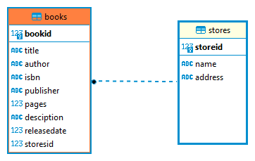

# BOOK API
 A bookshop API that allows users to create, read, update and delete books, and to create, read, update and delete stores and manage them.

## Technologies
1. Node.js
2. Express
3. Postgresql as database

## Installation
1. ### Clone the repo
   > git clone https://github.com/esla-ahme/node-express-postgresql-bookAPI

   >cd node-express-postgresql-bookAPI 
2. ### Dependencies and Requirements
    some dependencies are required for running the app

   1. [Nodemon](https://www.npmjs.com/package/nodemon) is required for running the app.

   2. [Postgresql](https://www.postgresql.org/) is required for running the app, edit `DATABASE_URL` in `.env` file to match your database.
    Table creation screpts are in [Scripts](./db/scripts.js) file.

    ER Diagram 


3. ### run app
    To run the app
    ```bash
    npm install
    npm start 
    ```
    the app must start serving on http://localhost:5000


## EndPoints
_Get all books_ | 
`GET api/v1/books`

_Get book by id_ | `GET api/v1/books/:id`

_Add book_ | `POST api/v1/books/add`
> book object must be in the form of
```json
{
   "title":"ABC", // required string
    "author":"SomeAuther", // required string
    "isbn":"123", // string
    "publisher":"Pub", // required string
    "pages":100, // number
    "desciption":"Learn Alphabet", // required string
    "releaseDate":2021, // number
    "storesId":12 // required number (id of the store)
}
```
_Update book_ | `PUT api/v1/books/update/:id` 
> same as add book

_delete book_ |
`DELETE /books/delete/:id`
<hr>

_Get all stores_ |  `GET api/v1/stores`

_Get store by id_ | `GET api/v1/stores/:id`

_Add store_ | `POST api/v1/stores/add`
> store object must be in the form of
```json
{
    "name":"Store Name", // required string
    "address":"Store Address", // required string
}
```
## Services
- [x] Logger
- [x] AuditService
- [ ] Swagger Documentation
- [ ] Authentication
- [ ] Testing